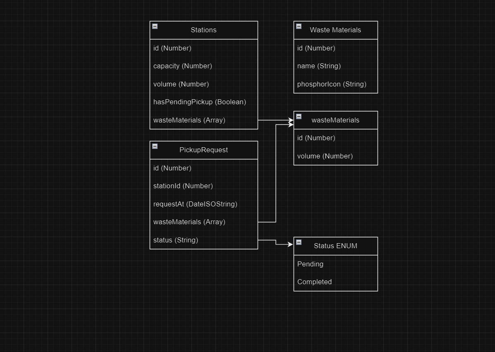

# Waste materials stations ♻️

This project has been built using React 18, [Typescript](https://www.typescriptlang.org/) and [TailwindCSS](https://tailwindcss.com/).

## React test code

In this project, the focus was on enhancing user interaction with their storage stations. Users can store materials in their stations by specifying the quantity. Once the station reaches 80% of its total capacity, a collection request is automatically generated, allowing the user to confirm the collection. Upon confirmation, the station's values are reset to zero, and the collection is added to the history log.

- ✅ The panel must have at least three waste storage stations.
- ✅ The user must inform the percentage of volume that each station is filled with.
- ✅ When a station reaches 80% capacity, a collection request should be generated automatically.
- ✅ After the collection request, the user can confirm the completion of the station's collection.
- ✅ After confirming the collection, the station's occupied volume should be reset to 0%.

## Preview 🛜

[Stations Page](https://repository-test-two.vercel.app)

## Frameworks/Libraries 📖

 - React 18 ⚛️
 - Typescript 🆒
 - Tailwindcss 🖌️
 - Material UI 📘

## Requirements 🔴

 - Node version 22.X ✅
 - Visual Studio Code 🌐
 - NPM version 10.X 🟥

### Visual Studio Code Extensions

 - Tailwind CSS Intellisense ✍️

## Starting Project 🧑‍💻

### Installing Packages ⬇️

Run `yarn` or `npm i` to install the dependencies packages.

### Running TailwindCSS ✏️

As the project uses tailwind as main css, before starting the project you have to run `yarn run tailwind:watch` or `npm run tailwind:watch` deepending on which one you are working, to build and watch the CSS changes.

### Running The Project 🏁

After starting the tailwind you have to create a new terminal to start the project by running the command `yarn start` or `npm start`.

## Diagram 

